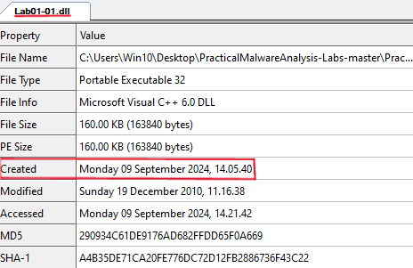
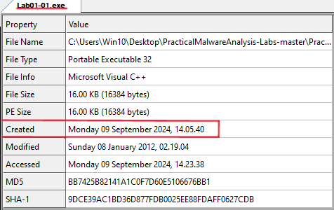
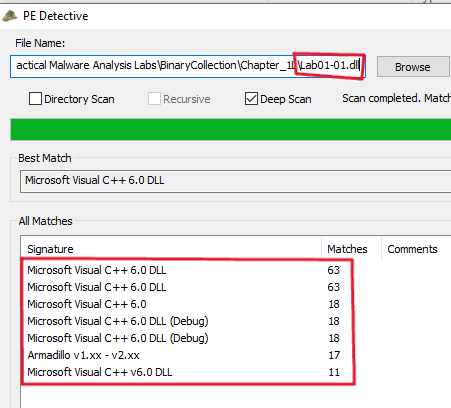
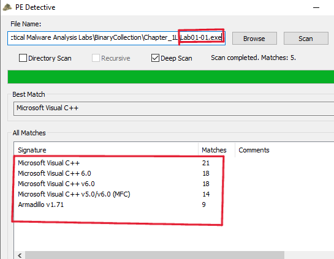
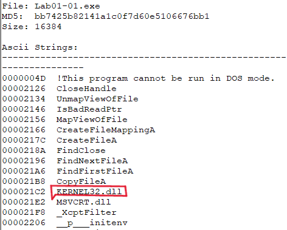
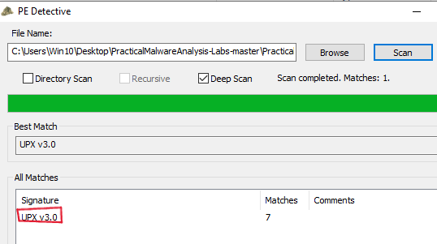
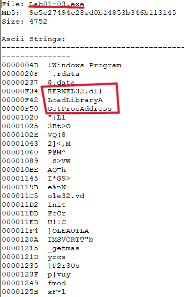
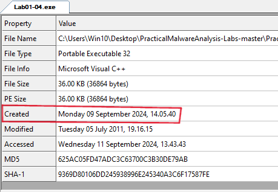
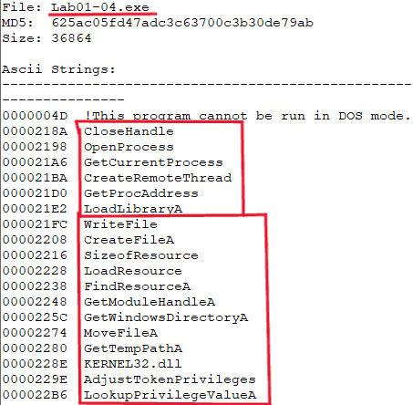
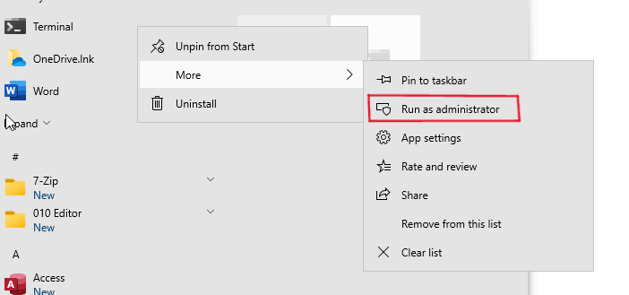

# Assignment 2
Class: CSC-466 *Malware Analisys*
Instructor: *Dr. Ajay Kumara*
Author: *Sinclair DeYoung*

---
**Lab 1-1**
Analyze the file Lab01-01.exe

<u>**Questions**</u>
1) Find the hashes for lab01-01.exe. Then, copy the hash into the search bar on
the Virtual Total website and check if the hash matches an existing signature.
&emsp;&emsp;&emsp;&emsp;&emsp;&emsp;MD5:&emsp;&emsp;&emsp;&emsp;&emsp;&emsp;&emsp;&emsp;&emsp;&emsp; SHA-265: 

- It matches **58/74**
[^fn1]
[^fn1]:Hint: You can use tools such as md5sum.exe, sha256.exe, or HashMyFiles,
which are available in the Flare VM desktop/Tools/File Information folder

2) Upload the Lab01-01.dll file to https://www.virustotal.com/gui/ and review the
report. Does this file match any existing antivirus signatures? If so, how many
detection engines reported a signature detection rate?

3) In a few sentences, describe how hashes like MD5, SHA-1, and SHA-256 are
useful for malware analysis.
<u>They allow us to track malware and compare programs to one another for confermation of authenticity.</u> 

4) When are lab01-01.exe and Lab01-01.dll files compiled? attach a screenshot
of the investigation, highlighting the relevant information with a red font
rectangle.

[^fn2]
[^fn2]:Hint: You can use the PEview tool (if it's not already installed on your VM, you
can download it from here). Using PEview the information is found under:
IMAGE_NT_HEADERS > IMAGE_FILE_HEADER > Time Date Stamp.
Alternatively, you can find the compiled information in the VirusTotal report.

5) Are there any indications that either of these files lab01-01.exe and Lab01-
01.dll is packed or obfuscated? If so, what are these indicators? Write your
observation in bullets and by highlighting with a red font rectangle on the
screenshot.
- Yes, there is by Armadilo for both the files

[^fn3]
[^fn3]:Hint: Indicator 1: Indicator 2: Indicator 3:

6) Considering Lab01-01.exe malware do any imports hint at what this malware
does? If so, which imports are they? Provide your observation in bullets and at
least two screenshots by highlighting the relevant information with a red font
rectangle.

[^fn4]
[^fn4]:Hint: Dependency Walker to explore functions

7) Are there any other files or host-based indicators that you could look for on
infected systems? Provide your observation in bullets and at least 2
screenshots by highlighting the relevant information with a red rectangle.

[^fn5]
[^fn5]:Hint: use string utility and extract bulk of string give close attention to
3
kerne132.d11

**Lab 1-2**
Analyze the file Lab01-02.exe

<u>**Questions**</u>

1) Find the hashes for lab01-02.exe. Then, copy the hash into the search bar on
the Virtual Total website and check if the hash matches an existing signature.
If so, how many detection engines reported a signature detection rate?
&emsp;&emsp;&emsp;&emsp;&emsp;&emsp;MD5:&emsp;&emsp;&emsp;&emsp;&emsp;&emsp;&emsp;&emsp;&emsp;&emsp; SHA-265: 

2) Explain why malware authors pack their malware. How could you analyze the
malware, even if it’s packed?
<u>Packing of malware can hide some of the functionality of the program making it hardewr to protect against and decode. To look at already packed malware you could uses PEid or PE Detective to analysis the malware.</u>

3) Are there any indications that this file Lab01-02.exe is packed or obfuscated?
If so, what are these indicators provide at least three indicators with
screenshots by highlighting the relevant information with a red rectangle and
observation in bullets? If the file is packed unpack it, then show the results in
screenshot for each indication and highlight in a red rectangle.

[^fn6]
[^fn6]:Screenshot of unpack.

4) Do any imports hint at this program’s functionality in the Lab01-02.exe file? If so, which imports are they and what do they tell you? Provide at least one screenshot by highlighting the relevant information with a red rectangle and your observation in bullet.

[^fn7]
[^fn7]:Hint: use dependency walker tool to investigate the function to make
observation

5) What host- or network-based indicators could be used to identify this malware
(Lab01-02.exe) on infected machines?

[^fn8]
[^fn8]:Hint: use strings VM utility

6) What host- or network-based indicators could be used to identify this malware
(Lab01-02.exe) on infected machines?

[^fn9]
[^fn9]:Hint: use strings VM utility

**Lab 1-3** [submission instruction as like above two labs that includes
screenshot, highlighting in red font and observation in bullets]
Analyze the file Lab01-03.exe

<u>**Questions**</u>

1) Upload the Lab01-03.exe file to http://www.VirusTotal.com/. Does it match any
existing antivirus definitions? What is the detection rate? show with one
screenshot.

2) Are there any indications that this file is packed or obfuscated? If so, what are these indicators? If the file is packed, unpack it if possible.

3) Do any imports hint at this program’s functionality? If so, which imports are
they and what do they tell you?

4) What host-or network-based indicators could be used to identify this malware
on infected machines?

**Lab 1-4** [ submission instruction as like above two labs that’s includes
screenshot, highlighting in red font box and observation in bullets]
Analyze the file Lab01-04.exe

<u>**Questions**</u>

1) Upload the Lab01-04.exe file to http://www.VirusTotal.com/. Does it match any
existing antivirus definitions?

2) Are there any indications that this file is packed or obfuscated? If so, what are these indicators? If the file is packed, unpack it if possible.

3) When was this program compiled?

4) Do any imports hint at this program’s functionality? If so, which imports are
they and what do they tell you?

5) After Flare VM installation by default Flare VM provides Windows
terminal (administrative: command prompt). The goal of this question is to
help you set up and install an additional, very convenient, and flexible
Terminal prompt on Windows OS, like the Ubuntu terminal. This will provide
enhanced functionality for working on Windows alongside the default Windows
PowerShell as well as Flare VM based Windows terminal.

<u>Under the *Desktop* follow the steps below:</u>

&emsp;a. To download the VCLibs package. In a PowerShell window run: wget
https://aka.ms/Microsoft.VCLibs.x64.14.00.Desktop.appx -
usebasicparsing -o VCLibs.appx

&emsp;b. You will see new VCLibs.appx packages show up in the desktop

&emsp;c. Next to download the Windows Terminal MSIX bundle run: wget
https://github.com/microsoft/terminal/releases/download/v1.15.3
465.0/Microsoft.WindowsTerminal_Win10_1.15.3465.0_8wekyb3d8bbwe.msixbundle -UseBasicParsing -o winterminal.msixbundle

&emsp;d. You will see new winterminal.msixbundle packages show up in the
desktop

e. <u>Next, add the VCLibs package as below:</u>
&emsp;f. Add-AppxPackage VCLibs.appx Hit ENTER

&emsp;g. In a PowerShell admin window, run:

&emsp;h. Add-AppxPackage winterminal.msixbundle Hit ENTER

8) You can find the newly installed Terminal in the Windows Start menu.
(Optional) Pin the Terminal to the taskbar. Open the Terminal from the
taskbar, and you will see a dark-themed terminal screen with green fonts
which distinguished form Flare VM based Windows terminal. Right-click on the
title bar of the terminal, select "Split View," as attached as reference and
explore additional features to obtain full points for this question. Attach 2-3
screenshots showing the new terminal functionalities (5 points).

