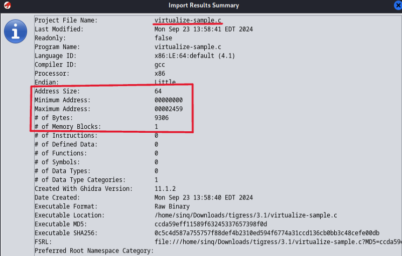

# Group Project
## Phase One
---
***Objectives***:

&ensp;1. Implement basic control flow obfuscation using Tigress on a sample C program | Apply Anti-Virtualization techniques and explore their effectiveness​
&ensp;2. Apply data obfuscation techniques like encoding and encryption
&ensp;3. Evaluate effectiveness of obfuscation by attempting to reverse engineer the obfuscated binary

---
#### Technical Background
Binary code obfuscation aims to make reverse engineering and analysis of compiled code more difficult. Tigress is an advanced source-to-source obfuscator for C programs that can apply various transformations:
&ensp;Control flow flattening
&ensp;Function virtualization
&ensp;Instruction substitution
&ensp;Bogus control flow insertion
&ensp;Data encoding/encryption
These techniques obscure the program's logic and data structures while preserving functionality.

### PowerPoint
This is the link to the powerpoints for the Group Project [PowerPoints](https://github.com/Lord-Sinq/Malware-Analysis/tree/main/Group-Project/Security-Projects/PowerPoints)

---
### Implement basic control flow obfuscation using Tigress on a sample C program
#### Step-by-Step

1. install Tigress
```
 git clone https://github.com/tigress-compiler/tigress.git
 cd tigress
 make
```
2. Create a C program
```
#include <stdio.h>

int main() {
    int secret = 42;
    printf("The secret number is: %d\n", secret);
    return 0;
}
```
3. Apply control flow flattening
```
./tigress --Environment=x86_64:Linux:Gcc:4.6 --Transform=Flatten --Function=main sample.c --out=flattened-sample.c
```
4. Apply Function Virtualization
```
./tigress --Environment=x86_64:Linux:Gcc:4.6 --Transform=Virtualize --Function=main sample.c --out=virtualize-sample.c
```
5. Apply Function Encoding
```
./tigress --Environment=x86_64:Linux:Gcc:4.6 --Transform=EncodeData --Function=main --LocalVariables=secret sample.c --out=encoded-sample.c
```
6. Attempt to reverse engineer using a tool like Ghidra and compare to the original binary





### Apply Anti-Virtualization techniques and explore their effectiveness​
**Methodology​** All ScreenShots related to this sections will be in the power point

There are two primary techniques for <u> implementing anti-virtualization techniques​</u>
1. Detect virtualization technology by searching for Virtual Machine artifacts. ​
2. Detecting debugging or other tools used by Reverse Engineers to dissect malware.

**Technique 1: *Instruction Set​***
In most modern CPU architectures of today, it is possible to query the CPU via the instruction set to determine if the malware is being ran with in a virtualized environment.​

**ASM​**
While this particular anti-VM technique may seem advanced, it is quite simple to work around and fix this issue. You can patch the instruction itself, or many hypervisors of today allow you to modify the CPUID directly as seen below.
​
**Technique 2: *Timestamp Counter***
A more advanced technique used by malware is the measuring  of time between each operation within the CPU. With Hypervisors often adding another layer of abstraction, this can induce additional latency in typical operations. This type of detection was used by the malware Sality. (Brunsdon, 2024) 

​This functionality could easily be wrapped into a method and if a VM is detected to call exit(). Could easily be patched with control flow if not obfuscated and integrated correctly by the author.​
​

---
#### References

Tigress C obfuscator | https://tigress.wtf/

"Towards Static Analysis of Virtualization-Obfuscated Binaries" by Johannes Kinder | https://www.plai.ifi.lmu.de/publications/wcre12-virtobf.pdf

"Behavioral Analysis of Obfuscated Code" by Federico Scrinzi | https://essay.utwente.nl/67522/1/Scrinzi_MA_SCS.pdf

"Combining learning with fuzzing for software deobfuscation" by Mark Janssen | https://www.codaspy.org/2018/toc.html

Brunsdon, D. (2024, September 17). The Malware Chronicles: Urelas, Sality, LockBit and StealC Examined. Hyas. https://www.hyas.com/blog/the-malware-chronicles-urelas-sality-lockbit-and-stealc-examined​

RDTSC — Read Time-Stamp Counter. (n.d.). https://www.felixcloutier.com/x86/rdtsc